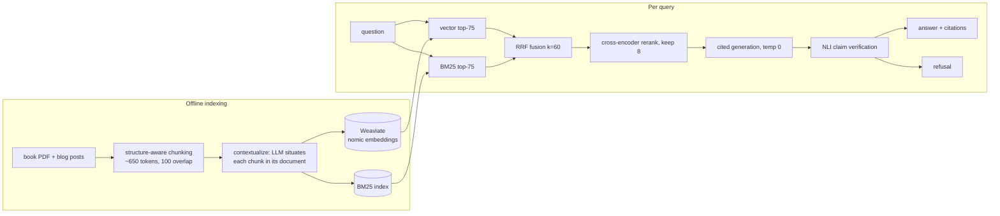

# Production RAG over "AI Engineering"

A retrieval-augmented question-answering system over Chip Huyen's
*AI Engineering* book and her blog, built to production standards:
hybrid retrieval with reciprocal rank fusion, cross-encoder reranking,
Anthropic-style contextual retrieval, citation-enforced generation with
NLI verification, and an evaluation harness wired to a CI quality gate.
Total model cost: $0 — local embeddings, local rerankers, local NLI,
Gemini free tier for generation.

The system cannot say anything it cannot prove: every claim carries a
citation to an exact source passage, claims are verified by an
entailment model after generation, and when the evidence isn't there,
it refuses.

## Two answers that show the whole system

Question the corpus can answer:

```
$ python src/guardrails.py "What is contextual retrieval and how does it improve retrieval quality?"

Contextual retrieval is a tactic that can increase the chance of relevant
documents being fetched [book/ch06#014]. It involves augmenting each chunk
with a short, succinct context that situates the chunk within its original
document [book/ch06#017]. This generated context is prepended to each chunk,
and the augmented chunk is then indexed by the retrieval algorithm
[book/ch06#017]. ...

(citation check: all claims supported)
```

Question it can't:

```
$ python src/guardrails.py "What is the population of Tashkent?"

I don't have enough information in the provided documents to answer this.
(refused before generation: best rerank score -9.39)
```

The second answer cost zero LLM tokens — the pre-generation guardrail
saw that the best reranked candidate scored far below the evidence
threshold and refused without calling the model.

## Architecture



Every stage is a separate module with files as interfaces
(`chunk_book.py`, `contextualize.py`, `embed.py`, `index.py`,
`retrieve.py`, `rerank.py`, `generate.py`, `guardrails.py`). No
LangChain: the retrieval logic is a few hundred lines of plain Python I
can defend line by line, and libraries are used for models and storage,
never for logic.

## Evaluation

Retrieval and generation are measured separately — they fail
differently, and a prompt tweak can't fix a retriever that fetched the
wrong chunks.

Retrieval metrics (no LLM, run in CI on every push): failure-rate@20
(definitionally identical to Anthropic's contextual-retrieval metric),
recall@k, MRR, against a golden set of questions in five categories:
factual, exact-term, multi-hop, paraphrase, and should-refuse.

Baseline results (933 chunks, hybrid = both arms fused with RRF):

| mode | rerank | recall@5 | MRR |
|---|---|---|---|
| bm25 | no | 78% | 0.571 |
| vector | no | 72% | 0.681 |
| hybrid | no | 94% | 0.800 |
| any | yes | 94% | 0.889 |

Fusion beats either arm alone before any reranking, and the
cross-encoder lifts every mode to the same ceiling — both textbook
claims, reproduced on this corpus. The full table regenerates with
`python eval/ablate.py` into `eval/ablation.md`.

An early book-only comparison of contextual retrieval
(`eval/book_contextual_comparison.md`) shows the technique working as
published: contextual embeddings halved the vector arm's failure-rate@20
(17% to 8%, rescuing a cross-chapter multi-hop question), and
contextual BM25 lifted lexical recall@5 by 8 points. Anthropic reported
a 35% relative failure reduction for contextual embeddings; this corpus
measures ~53% on a smaller, harder question set — directionally
consistent, honestly caveated.

Generation metrics (`eval/run_gen_eval.py`): refusal correctness in
both directions (refusing without evidence and not over-refusing with
it), faithfulness scored by the same NLI verifier the runtime guardrail
uses, and fabricated-citation counting. Across 19 questions: every
refusal trap refused, and **zero fabricated citations** — the model has
never cited a chunk it wasn't given. Faithfulness averages 0.76, with
the low scores concentrated on multi-hop questions whose answers
synthesize across chunks — sentence-level NLI verifies cross-chunk
synthesis conservatively, an honest limitation split between verifier
strictness and genuinely under-supported claims. The one "false
refusal" is a question whose evidence is a detached PDF footnote the
retriever cannot reach (see limitations) — the guardrail refusing there
is the designed behavior.

The CI workflow rebuilds the blog corpus from the live web, embeds and
indexes it locally (no API keys), and fails the build if
failure-rate@20 regresses past the threshold.

## Things that broke and what they taught

These cost real hours and shaped the design more than anything that
worked on the first try.

1. **The embedder's window.** The original plan used BGE-small, which
   truncates at 512 tokens. A ~650-token chunk plus a 50–100-token
   contextual prefix would have been silently cut — contextual
   retrieval would have *hurt* recall invisibly. Switched to
   nomic-embed-text-v1.5 (8k window) before indexing anything.
2. **Thinking mode ate the answers.** Gemini 2.5 Flash reasons by
   default, and the reasoning budget came out of `max_output_tokens`:
   my chunk contexts came back 3–5 words long. Contextualization is
   summarization, not reasoning — `thinking_budget: 0` fixed it.
3. **Explicit prompt caching is a paid feature in disguise.** The
   free tier returns `TotalCachedContentStorageTokensPerModelFreeTier
   limit=0`. The code tries explicit caching, logs the refusal, and
   falls back — while implicit caching (earned by document-first
   prompt ordering) measured up to 97% prefix reuse for free.
4. **NLI models can't read long premises.** My citation verifier
   scored a verbatim-true claim at p=0.001 because MNLI-trained models
   drift to "neutral" on 300-word premises. Claims now score against
   each premise sentence and adjacent pair, best entailment wins
   (the SummaC trick). The verifier's own selftest caught this.
5. **Attribution phrasing breaks entailment.** "Two solutions *named
   in the book* are X and Y" scores p=0.003 against a premise that
   says exactly "are X and Y" — the premise never calls itself "the
   book". Measured, then fixed at both ends: the prompt now bans
   attribution phrases (the citation *is* the attribution) and the
   verifier strips them before scoring.
6. **Free-tier quota archaeology.** Runs kept dying with 429s. The
   error payloads eventually revealed the real limits (20 requests/day
   per key per model) and the real culprit — another project of mine
   sharing the same API keys. Per-stage disk caching meant no failed
   run ever cost anything twice.

## Corpus and copyright

The book is copyrighted and never leaves my machine: `data/` is
git-ignored, and CI runs on the blog half of the corpus, which
`ingest_blog.py` fetches from the live web at build time. Anyone
cloning this repo can reproduce a working system with one command and
no book. This mirrors the standard production pattern of public code
over private data.

## Running it

```
docker compose up -d                      # Weaviate
pip install -r requirements.txt
python src/ingest_blog.py                     # fetch corpus (blog half)
python src/chunk_blog.py
python src/embed.py data/index/baseline data/processed/blog_chunks.jsonl
python src/index.py data/index/baseline data/processed/blog_chunks.jsonl
python src/guardrails.py "when should I finetune instead of using RAG?"
```

Generation needs `GEMINI_API_KEYS` (comma-separated, free tier) in
`.env`. Retrieval, reranking, NLI verification and all retrieval evals
run fully offline.

## Limitations

- The golden set is still small and partially unverified; numbers are
  provisional until every entry is manually checked. On easy questions
  failure-rate@20 saturates at 0% — the hard paraphrase and multi-hop
  entries exist precisely to fix that.
- The default reranker truncates (query + chunk) pairs at 512 tokens;
  relevance signal concentrates early, but long-chunk tails are
  invisible to it. A long-window reranker is a config swap away at
  ~30x the latency.
- The NLI verifier judges sentences independently; a claim synthesized
  across two cited chunks can score as unsupported even when the pair
  jointly supports it.
- One corpus, one language, one embedding model — the ablation
  harness exists to test such swaps, not to claim generality.
