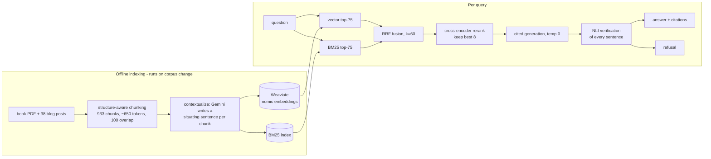

# grounded-rag

[](https://github.com/nurbekkmu/grounded-rag/actions)


**A question-answering system over Chip Huyen's *AI Engineering* book
and her blog (933 chunks).** Every sentence of an answer cites its exact
source passage, a local NLI model re-verifies each claim after
generation, and when the evidence isn't in the corpus the system refuses
instead of improvising.

Stack: plain Python (no LangChain), Weaviate, local embedding/rerank/NLI
models, Gemini Flash free tier. Runs end-to-end on a CPU laptop.

## Key results

- **Zero fabricated citations** across every answer this system has ever produced
- **Faithfulness 0.82** — share of answer sentences the NLI verifier entails from their cited chunks
- **All refusal traps refused**; off-corpus questions are rejected *before* generation, costing 0 LLM tokens
- **Contextual retrieval halved the vector arm's failure@20** (17% → 8%) in a controlled comparison — directionally consistent with Anthropic's published 35% relative reduction
- **Hybrid fusion beats both single retrievers** before any reranking (13% failure@20, 0.702 MRR)
- **CI quality gate**: every push rebuilds the corpus from the live web, runs 16 unit tests, and fails if retrieval regresses

## Demo

A question the corpus can answer:

```
$ python src/guardrails.py "What is contextual retrieval and how does it improve retrieval quality?"

Contextual retrieval is a tactic that can increase the chance of relevant
documents being fetched [book/ch06#014]. It involves augmenting each chunk
with a short, succinct context that situates the chunk within its original
document [book/ch06#017]. ...

(citation check: all claims supported)
```

(The system answers questions about contextual retrieval by citing the
book's section on contextual retrieval — the same technique it uses
internally.)

A question it can't answer:

```
$ python src/guardrails.py "What is the population of Tashkent?"

I don't have enough information in the provided documents to answer this.
(refused before generation: best rerank score -9.39)
```

## Architecture



- **Two retrieval arms** because they fail differently: embeddings handle
  paraphrase but blur exact identifiers; BM25 nails exact terms but can't
  see meaning. RRF merges them by rank alone, sidestepping incomparable
  score scales.
- **Cross-encoder rerank** reads (query, chunk) pairs jointly — something
  the fast retrieval stages structurally can't do — and keeps the best 8.
- **Post-generation verification**: a local NLI model checks each answer
  sentence against the chunk it cites, SummaC-style. An answer that fails
  verification is downgraded to a refusal.
- **No framework logic**: every stage is a plain Python module with JSONL
  interfaces. Libraries are used for models and storage, never for
  retrieval logic. All knobs live in `config.yaml`; CLI flags override.

## Evaluation

Retrieval and generation are graded separately against a 19-question
golden set in five categories: factual, exact-term, multi-hop,
paraphrase, and should-refuse. Every entry is verified against its
evidence chunks, with the verification method recorded in the file.

### Retrieval (hardened golden set, n=15 answerable)

| mode | rerank | failure@20 | recall@5 | MRR |
|---|---|---|---|---|
| bm25 | no | 13% | 67% | 0.567 |
| bm25 | yes | 13% | 80% | 0.697 |
| vector | no | 20% | 67% | 0.535 |
| vector | yes | 13% | 80% | 0.689 |
| hybrid | no | **13%** | **80%** | **0.702** |
| hybrid | yes | 20% | 80% | 0.689 |

Two caveats the table itself shows: one failure is a deliberately
unanswerable canary (evidence stranded in a PDF footnote), and reranking
demotes one paraphrase question's evidence — a measured cross-encoder
weakness, documented rather than hidden. Regenerate with
`python eval/ablate.py`; `eval/ablation.md` holds all twelve rows.

### Contextual retrieval

Prepending an LLM-generated context to each chunk before indexing
(book-only controlled comparison, `eval/book_contextual_comparison.md`):

- Vector failure@20: **17% → 8%** (~53% relative; Anthropic reported 35%)
- BM25 recall@5: **+8 points**
- Full-corpus hybrid: barely moves — fusion already rescues most of what
  contextualization rescues, and reranked rows are identical across
  indexes (the reranker rescores raw text, so shortlists converge)

**Lesson:** contextual retrieval helps a single retriever most; stacked
defenses overlap. Worth knowing before paying to contextualize a corpus.

### Generation

- Faithfulness 0.82, with misses concentrated on multi-hop answers that
  synthesize across two chunks — partly verifier strictness (sentence-level
  NLI judges cross-chunk synthesis conservatively), partly loose claims.
  Below my 0.85 gate; multi-premise verification is the top roadmap item.
- False refusals: 1–3 of 15 depending on run (one is the footnote canary,
  where refusing is designed behavior; the rest flip with approximate-index
  variance). At n=15, one question moves any metric ~7 points.
- Quote-first answering (prompt v3) — answering in the source's own
  words — was predicted to raise faithfulness. Measured: a statistical
  tie (0.8166 vs 0.8161). Prediction falsified, feature kept for style.

### Latency (CPU laptop, warm caches)

| stage | P50 | P95 |
|---|---|---|
| hybrid retrieval (incl. query embedding) | 1.4 s | 1.7 s |
| cross-encoder rerank (75 pairs) | 6.2 s | 7.2 s |
| generation (Gemini Flash) | 4.3 s | 6.3 s |
| NLI claim verification | 7.8 s | 90 s |
| end-to-end | ~20 s | ~104 s |

The reranker is 81% of local latency; verification's tail scales with
answer length × cited chunks. Known fixes: candidate caps, verification
caps, ONNX-quantized cross-encoders, any GPU. Cold start is 26–46 s of
one-time model loading. This system deliberately spends latency on
verifiability.

## What broke, and what it taught me

1. **Embedder window** — BGE-small's 512-token limit would have silently
   truncated chunk + contextual prefix; switched to nomic-embed-text-v1.5
   (8k) before indexing anything.
2. **Thinking mode ate the answers** — Gemini 2.5 Flash reasons by
   default and the reasoning spends `max_output_tokens`; contexts came
   back 3–5 words until `thinking_budget: 0`.
3. **Explicit prompt caching is paid-tier only** — the code logs the 429
   and falls back; implicit caching (document-first prompts) measured up
   to 97% prefix reuse for free.
4. **NLI can't read long premises** — a verbatim-true claim scored
   p=0.001; fixed with sentence-level premises + adjacent pairs, max
   aggregation. The verifier's own selftest caught it.
5. **Attribution phrasing breaks entailment** — "named in the book are X"
   scores p=0.003 against a premise saying "are X"; the prompt now bans
   attribution phrases and the verifier strips them.
6. **Free-tier quota archaeology** — real limit is 20 requests/day/key/
   model, and another project was quietly sharing the same keys. Every
   stage caches to disk, so eleven days of quota walls never cost the
   same token twice.
7. **PDF footnotes detach from meaning** — "self-consistency" exists only
   as a stranded footnote fragment no retriever can bridge semantically;
   kept in the golden set as a canary.
8. **A bigger reranker isn't a better one** — bge-reranker-base vs
   MiniLM: identical MRR, 12x the latency. The paraphrase weakness is
   method-level, not size-level.

## Papers behind the design

I didn't invent these techniques — I read the papers and turned them
into one working system. Each entry maps to a specific decision here:

| paper | what it shaped in this repo |
|---|---|
| Lewis et al. 2020 — [Retrieval-Augmented Generation](https://arxiv.org/abs/2005.11401) | the overall retrieve-then-generate architecture |
| Robertson & Zaragoza 2009 — [The Probabilistic Relevance Framework: BM25 and Beyond](https://www.staff.city.ac.uk/~sbrp622/papers/foundations_bm25_review.pdf) | the lexical retrieval arm |
| Karpukhin et al. 2020 — [Dense Passage Retrieval](https://arxiv.org/abs/2004.04906) | the dense arm: separate query/passage encoding, top-k over embeddings |
| Cormack et al. 2009 — [Reciprocal Rank Fusion](https://plg.uwaterloo.ca/~gvcormac/cormacksigir09-rrf.pdf) | merging the two arms by rank position (k=60), sidestepping incomparable score scales |
| Nogueira & Cho 2019 — [Passage Re-ranking with BERT](https://arxiv.org/abs/1901.04085) | the cross-encoder rerank stage |
| Nussbaum et al. 2024 — [Nomic Embed](https://arxiv.org/abs/2402.01613) | embedding choice: an 8k-window model so contextual prefixes never silently truncate (broke-lesson #1) |
| Laban et al. 2022 — [SummaC](https://arxiv.org/abs/2111.09525) | sentence-level NLI premises with max aggregation in the claim verifier (broke-lesson #4) |
| Williams et al. 2018 — [MultiNLI](https://arxiv.org/abs/1704.05426) | understanding *why* the verifier drifted neutral on long premises: its training data is sentence pairs |
| Anthropic 2024 — [Contextual Retrieval](https://www.anthropic.com/engineering/contextual-retrieval) (engineering post) | chunk contextualization, and the published failure-rate numbers my ablation reproduces |

## Quickstart

```
docker compose up -d                      # Weaviate
pip install -r requirements.txt
python src/ingest_blog.py                 # fetch the blog half of the corpus
python src/chunk_blog.py
python src/embed.py data/index/baseline data/processed/blog_chunks.jsonl
python src/index.py data/index/baseline data/processed/blog_chunks.jsonl
python src/guardrails.py "when should I finetune instead of using RAG?"
```

Generation needs `GEMINI_API_KEYS` in `.env` (comma-separated, free
tier — see `.env.example`). Retrieval, reranking, NLI verification,
unit tests, and all retrieval evals run fully offline.

The book is copyrighted and never leaves my machine: `data/` is
git-ignored, and CI reproduces the system from the blog half alone,
fetched live at build time.

## Repo tour

| path | what it does |
|---|---|
| `src/chunk_book.py`, `src/chunk_blog.py` | structure-aware chunking; shared `ParagraphPacker` |
| `src/contextualize.py` | Anthropic-style chunk contexts, disk-cached, key-rotating |
| `src/embed.py`, `src/index.py` | local Nomic embeddings; Weaviate + BM25 index builds |
| `src/retrieve.py`, `src/rerank.py` | hybrid retrieval + RRF; cross-encoder shortlist |
| `src/generate.py`, `src/guardrails.py` | cited generation; evidence floor + NLI verification |
| `eval/` | golden set, retrieval + generation metrics, ablation harness, latency recorder |
| `prompts/` | versioned prompt configs (a prompt change is a config change) |
| `config.yaml` | runtime knobs; CLI > config > defaults |

## Limitations

- 19 golden questions: enough to steer development, small enough that one
  question moves recall ~7 points. Read the numbers at that resolution.
- The default reranker truncates pairs at 512 tokens and can demote
  paraphrase evidence (measured twice, documented).
- Sentence-level NLI can score jointly-supported claims as unsupported.
- ~20 s end-to-end on CPU is research-tool latency; the path to 2–4 s is
  known and costed above.
- One corpus, one language, one embedding model.

**Roadmap, in order:** multi-premise faithfulness verification → latency
caps → metadata-filtered retrieval → observability on the existing trace
hooks.

## Credits

Corpus: Chip Huyen's [*AI Engineering*](https://www.oreilly.com/library/view/ai-engineering/9781098166298/)
(local copy only, never redistributed) and her [blog](https://huyenchip.com/blog/).
Architecture blueprint: Aishwarya Srinivasan's "5 AI Engineer Projects
to Build in 2026". Contextual retrieval:
[Anthropic's engineering post](https://www.anthropic.com/engineering/contextual-retrieval).
