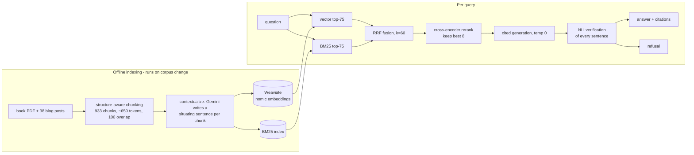

# grounded-rag

[](https://github.com/nurbekkmu/grounded-rag/actions)


A question-answering system over Chip Huyen's *AI Engineering* book and
her blog. Every claim in an
answer cites the exact source passage, an entailment model re-checks
every sentence after generation, and when the evidence isn't there, the
system says so instead of improvising.

## Two answers that show the whole system

A question the corpus can answer:

```
$ python src/guardrails.py "What is contextual retrieval and how does it improve retrieval quality?"

Contextual retrieval is a tactic that can increase the chance of relevant
documents being fetched [book/ch06#014]. It involves augmenting each chunk
with a short, succinct context that situates the chunk within its original
document [book/ch06#017]. This generated context is prepended to each chunk,
and the augmented chunk is then indexed by the retrieval algorithm
[book/ch06#017]. ...

(citation check: all claims supported)
```

Yes — the system answers questions about contextual retrieval by citing
the book's section on contextual retrieval, which is also the technique
it uses internally. That circularity was too good to leave out of the
demo.

A question it can't answer:

```
$ python src/guardrails.py "What is the population of Tashkent?"

I don't have enough information in the provided documents to answer this.
(refused before generation: best rerank score -9.39)
```

The refusal cost zero LLM tokens. The pre-generation guardrail saw that
the best retrieved candidate scored -9.4 against the evidence threshold
and never called the model at all.

## How it works



Two retrieval arms because they fail differently: embeddings understand
paraphrase but blur exact identifiers, BM25 nails exact terms but can't
see meaning. Reciprocal rank fusion merges them by rank position alone,
which conveniently sidesteps the problem that their scores live on
incomparable scales. A cross-encoder then reads (query, chunk) pairs
together — something the fast retrieval stages structurally can't do —
and keeps the best 8 for generation.

The part most RAG projects skip is after generation: a local NLI model
checks each sentence of the answer against the chunk it cites,
SummaC-style. Citations here aren't decoration; they're verified
claims, and an answer that fails verification gets downgraded to a
refusal.

Every stage is a plain Python module with JSONL files as interfaces.
No LangChain — the retrieval logic is code I can defend line by line,
and libraries are used for models and storage, never for logic. All
runtime knobs live in `config.yaml`; CLI flags override it.

## What the numbers say

Retrieval and generation get graded separately, because they fail
differently and a prompt tweak can't fix a retriever that fetched the
wrong chunks. The exam is a 19-question golden set in five categories:
factual, exact-term, multi-hop, paraphrase (no word overlap with the
evidence), and should-refuse. Every entry was verified against its
evidence chunks, with the method recorded per entry in the file itself
(full evidence reads, NLI cross-checks scoring 11/15 at 0.95+, and
corpus-absence searches proving the refusal questions really have no
answer here).

### Retrieval (hardened golden set, n=15 answerable)

| mode | rerank | failure@20 | recall@5 | MRR |
|---|---|---|---|---|
| bm25 | no | 13% | 67% | 0.567 |
| bm25 | yes | 13% | 80% | 0.697 |
| vector | no | 20% | 67% | 0.535 |
| vector | yes | 13% | 80% | 0.689 |
| hybrid | no | **13%** | **80%** | **0.702** |
| hybrid | yes | 20% | 80% | 0.689 |

Hybrid fusion beats either arm alone before any reranking — the
textbook claim, reproduced here. Two honest wrinkles the table also
shows: one failure is a deliberately unanswerable canary question (its
evidence lives in a detached PDF footnote, see limitations), and
reranking pushes one paraphrase question's evidence out of the top-20,
which is the same cross-encoder weakness showing up in two different
metrics. The table regenerates with `python eval/ablate.py`;
`eval/ablation.md` holds all twelve rows, baseline and contextual.

### Contextual retrieval vs. Anthropic's published numbers

A controlled book-only comparison (`eval/book_contextual_comparison.md`):
adding LLM-generated context to each chunk before indexing **halved the
vector arm's failure-rate@20 (17% → 8%)** and lifted BM25's recall@5 by
8 points. Anthropic reported a 35% relative failure reduction for
contextual embeddings; I measure ~53% on a smaller, harder question
set. Directionally consistent, and the single rescued question was
exactly the ambiguous cross-chapter case the technique targets.

On the full corpus the pattern repeats at the arm level — contextual
embeddings cut the vector arm's failure rate from 20% to 13% and
lifted both arms' MRR — but the fused hybrid barely moves, because
fusion was already rescuing most of what contextualization rescues.
Every reranked row is identical across the two indexes, which makes
sense once you see it: the reranker rescores raw chunk text, so once
either index gets the right candidates into the net, the shortlists
converge. The practical lesson: contextual retrieval helps a single
retriever most; stacked defenses overlap. Worth knowing before paying
to contextualize a corpus. (One suspect for the smaller full-corpus
effect: the blog half's contexts came from a terser model, averaging
23 words against the book's 45.)

I also tested a 12x-slower reranker (bge-reranker-base) against the
MiniLM default: identical MRR, worse recall@5. MiniLM keeps its seat,
and now there's a number attached to that decision instead of a vibe.

### Generation

Across the full golden set: every refusal trap refused, and **zero
fabricated citations across every answer this system has ever
produced**. The model has never once cited a chunk it wasn't given.

Faithfulness — the fraction of answer sentences the NLI verifier can
entail from their cited chunks — is 0.82, with the remaining misses
concentrated on multi-hop answers that synthesize across two chunks.
Sentence-level NLI judges cross-chunk synthesis conservatively, so
that number is part verifier strictness, part genuinely loose claims.
Still shy of the 0.85 I'd gate on; multi-premise verification is the
top roadmap item. False refusals sit at one to three of fifteen
depending on the run — one is the footnote canary, where refusing is
the designed behavior, and the others flip with the approximate
index's run-to-run variance. At n=15, one question moves any of these
numbers by about seven points; read them at that resolution.

One more experiment, because the corpus author writes more clearly
than a paraphrase of her does: prompt v3 makes the system answer in
the source's own words — verbatim quotes, trimmed to the relevant
sentences, cited. I predicted this would raise faithfulness, since a
verbatim quote is the easiest thing an NLI model can entail. Measured:
a statistical tie (0.8166 vs 0.8161). The prediction was wrong — the
verifier already entailed the quotable sentences; the misses live in
the connective tissue between quotes. The feature stays anyway. Its
point was never the metric.

### Latency, measured not guessed

Per-stage flight recorder (`eval/measure_latency.py`), CPU-only laptop,
warm caches, cold start excluded and reported separately:

| stage | P50 | P95 |
|---|---|---|
| hybrid retrieval (incl. query embedding) | 1.4 s | 1.7 s |
| cross-encoder rerank (75 pairs) | 6.2 s | 7.2 s |
| generation (Gemini Flash) | 4.3 s | 6.3 s |
| NLI claim verification | 7.8 s | 90 s |
| end-to-end | ~20 s | ~104 s |

Is 20 seconds good? No. But I know where every second goes: the
reranker is 81% of local latency, and verification has an unbounded
tail because its cost scales with answer length times cited chunks
(one long answer spent 90 seconds there). The fixes are ordinary —
candidate caps, verification caps, ONNX-quantized cross-encoders, any
GPU — and this system deliberately spends latency on verifiability.
Cold start is 26–46 s of one-time model loading; a real deployment
loads once.

## Eight things that broke and what they taught me

These cost real hours and shaped the design more than anything that
worked on the first try.

1. **The embedder's window.** The original plan used BGE-small, which
   truncates at 512 tokens. A 650-token chunk plus its contextual
   prefix would have been silently cut, and contextual retrieval would
   have *hurt* recall invisibly. Switched to nomic-embed-text-v1.5
   (8k window) before indexing anything.
2. **Thinking mode ate the answers.** Gemini 2.5 Flash reasons by
   default and the reasoning spends `max_output_tokens`. My chunk
   contexts came back 3–5 words long until `thinking_budget: 0`.
   Contextualization is summarization, not reasoning.
3. **Explicit prompt caching is a paid feature in disguise.** The free
   tier returns `TotalCachedContentStorageTokensPerModelFreeTier
   limit=0`. The code still tries it, logs the refusal, and falls back
   — while implicit caching, earned by putting the document first in
   the prompt, measured up to 97% prefix reuse for free.
4. **NLI models can't read long premises.** My verifier scored a
   verbatim-true claim at p=0.001, because MNLI-trained models drift
   to "neutral" on 300-word premises. Claims now score against each
   premise sentence and adjacent pair, best score wins. The verifier's
   own selftest is what caught it.
5. **Attribution phrasing breaks entailment.** "Two solutions *named
   in the book* are X and Y" scores p=0.003 against a premise that
   says exactly "are X and Y" — the premise never calls itself "the
   book". Fixed at both ends: the prompt bans attribution phrases
   (the citation is the attribution) and the verifier strips them.
6. **Free-tier quota archaeology.** Runs kept dying with 429s. The
   error payloads eventually revealed the real limits (20 requests per
   day per key per model) and the real culprit: another project of
   mine quietly sharing the same API keys on a 15-minute cron. Every
   stage caches to disk, so eleven days of quota walls never cost the
   same token twice.
7. **PDF footnotes detach from their meaning.** The name
   "self-consistency" exists in exactly one chunk, as a footnote
   fragment stranded far from the technique it names, because PDFs put
   footnotes at page bottoms. No retriever can bridge that gap
   semantically. That question stays in the golden set as a canary,
   and footnote-aware chunking is on the roadmap.
8. **A bigger reranker isn't a better one.** When MiniLM demoted
   correct evidence on paraphrase questions, the obvious move was a
   stronger model. Measured it: same MRR, 12x the latency. The
   weakness is method-level, not size-level.

## Corpus and copyright

The book is copyrighted and never leaves my machine. `data/` is
git-ignored, and CI runs on the blog half of the corpus, which
`src/ingest_blog.py` fetches from the live web at build time — so
anyone cloning this repo can reproduce a working system without the
book. Coverage is verified, not assumed: the 449 book chunks span every
content page (the one uncovered page in the span is blank — I checked),
and the 38 ingested posts match the live blog index exactly.

## Running it

```
docker compose up -d                      # Weaviate
pip install -r requirements.txt
python src/ingest_blog.py                 # fetch the blog half of the corpus
python src/chunk_blog.py
python src/embed.py data/index/baseline data/processed/blog_chunks.jsonl
python src/index.py data/index/baseline data/processed/blog_chunks.jsonl
python src/guardrails.py "when should I finetune instead of using RAG?"
```

Generation needs `GEMINI_API_KEYS` in `.env` (comma-separated, free
tier — see `.env.example`). Retrieval, reranking, NLI verification, the
unit tests, and all retrieval evals run fully offline.

CI does the same thing on every push: rebuild the corpus from the live
web, run the 16 unit tests, spin up Weaviate as a service container,
and fail the build if failure-rate@20 regresses. The badge at the top
is that gate.

## Repo tour

| path | what it does |
|---|---|
| `src/chunk_book.py`, `src/chunk_blog.py` | structure-aware chunking; shared `ParagraphPacker` |
| `src/contextualize.py` | Anthropic-style chunk contexts, disk-cached, key-rotating |
| `src/embed.py`, `src/index.py` | local Nomic embeddings; Weaviate + BM25 index builds |
| `src/retrieve.py`, `src/rerank.py` | hybrid retrieval + RRF; cross-encoder shortlist |
| `src/generate.py`, `src/guardrails.py` | cited generation; evidence floor + NLI verification |
| `eval/` | golden set, retrieval + generation metrics, ablation harness, latency recorder |
| `prompts/` | versioned prompt configs (a prompt change is a config change) |
| `config.yaml` | runtime knobs; CLI > config > defaults |

## Limitations, honestly

- Nineteen golden questions is enough to steer development and small
  enough that one question moves recall by ~7 points. Growing the set
  is ongoing work, and the numbers should be read at that resolution.
- The default reranker truncates (query + chunk) pairs at 512 tokens,
  and reranking can demote paraphrase evidence (measured twice, kept
  documented rather than hidden).
- The NLI verifier judges sentences one at a time; a claim that two
  cited chunks support jointly can score as unsupported. Multi-premise
  verification is the fix and the top roadmap item.
- ~20 s end-to-end on CPU is a research tool's latency, not a chat
  product's. The path to 2–4 s is known and costed above.
- One corpus, one language, one embedding model. The ablation harness
  exists to test such swaps, not to claim generality.

Next, in order: multi-premise faithfulness verification, latency caps,
metadata-filtered retrieval (the Weaviate objects already carry the
fields), and an observability layer on the trace hooks that every
response already emits.

## Credits

Corpus: Chip Huyen's [*AI Engineering*](https://www.oreilly.com/library/view/ai-engineering/9781098166298/)
(local copy only, never redistributed) and her [blog](https://huyenchip.com/blog/).
Architecture blueprint: Aishwarya Srinivasan's "5 AI Engineer Projects
to Build in 2026". Contextual retrieval:
[Anthropic's engineering post](https://www.anthropic.com/engineering/contextual-retrieval).
